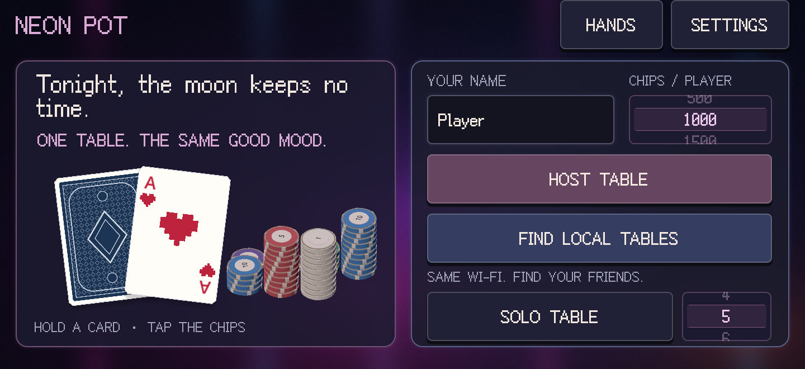

# Neon Pot

**A face-to-face Texas Hold'em game for quiet nights and familiar faces.**

Neon Pot / 霓虹夜河 is a solo-developed poker game by Alex Zhao, built with Godot 4.6.2 and GDScript. Play with friends on the same Wi-Fi, fill empty seats with AI, or practise at a solo table. Chips are virtual: there are no payments, cash prizes, action timers, live odds or hand-strength hints.



## Play

[**Download the latest release — Android APK / Windows EXE and ZIP**](https://github.com/Alexzspace/NeonPot/releases/latest)

The community build starts in **English** on a fresh installation. Simplified Chinese is available in Settings; your language choice is saved. Updating an existing installation preserves its chosen language.

- **Windows x64:** extract the Windows ZIP and run `NeonPot.exe`. A D3D12-capable graphics device/driver is required by the configured Mobile renderer. The EXE is not Authenticode-signed.
- **Android ARM64:** install the APK on Android 7.0 or newer. This is a directly distributed, debug-signed build, not a Google Play release. Allow installation from your chosen file/browser app if Android requests it. A differently signed existing installation cannot be updated with this APK; do not uninstall it unless you are willing to lose its local data.
- **Solo:** choose the table size and select **SOLO TABLE**.
- **Friends:** join the same Wi-Fi network. One player selects **HOST TABLE**; the others select **FIND LOCAL TABLES**. Allow private-network access if Windows asks. Guest Wi-Fi with client isolation may prevent discovery.

See [How to play](docs/PLAYING.md) for controls and table setup. Download builds from [GitHub Releases](https://github.com/Alexzspace/NeonPot/releases/latest). The Windows ZIP includes player instructions and license notices; a standalone EXE is also available.

## Features

- Two to six seats, with host-managed AI mixed into local multiplayer.
- Complete Hold'em betting, all-ins, side pots, split pots and persistent stacks between hands.
- Hold your chips to select individual denominations; withdraw staged chips, exchange denominations or use the ordinary action buttons and precise raise editor.
- Interactive cards and chip stacks, coordinated dealing and payouts, generated sound effects and configurable haptics.
- Four card collections, a local drawing workshop, a music library and a bilingual beginner guide.
- Host-authoritative multiplayer; each player receives only their own private cards until cards are legitimately revealed.

## Run from source

1. Install [Godot 4.6.2](https://godotengine.org/download/archive/4.6.2-stable/), standard edition. No .NET runtime is needed for this GDScript project.
2. Import `project.godot` in Godot and let resources finish importing.
3. Press **F5**. The project uses the Mobile renderer.

All runtime assets are included. Original lossless music, editor caches, signing keys, personal preferences and compiled games are intentionally absent from this source directory.

For tests and Windows/Android exports, see [Building and testing](docs/BUILDING.md).

## Repository map

```text
project.godot           Godot project and entry scene
export_presets.cfg      Windows and Android export configuration, no private keys
scripts/               Game rules, networking, UI, cards, chips and music
scenes/                Boot and main scenes
assets/                Fonts, music, generated sounds, shaders and startup media
tests/                 Rules, UI, lifecycle and real-process network regressions
tools/                 Configurable build, test and sound-generation tools
android-template/      Android manifest overlays and template installer
native/ios/            Optional iOS haptics source; not built or device-validated
docs/                  Player, build, architecture and release documentation
licenses/              Engine, media and third-party notices
LICENSE                MIT license for original project work
THIRD_PARTY_NOTICES.md  Asset-specific terms and credits
```

## Scope

Multiplayer is designed for a shared local network; there is no hosted online matchmaking service. A disconnect pauses the table, and continuing requires a new room. Reconnection, host migration and saved-hand recovery are not implemented. Custom deck drawings and imported music stay local to your device.

Windows and Android are the packaged targets. iOS source scaffolding is included, but no iOS binary or device support is claimed. Mobile sound, haptics and foldable behaviour vary by hardware.

## License and credits

Original game code, procedural artwork and generated sound effects are available under the [MIT License](LICENSE). Third-party assets and supplied media are **not** relicensed by that MIT grant: see [THIRD_PARTY_NOTICES.md](THIRD_PARTY_NOTICES.md). The maintainer has confirmed permission to include the ten bundled music tracks in this distribution; this is not a general license to extract, sublicense or reuse those tracks in another project.

Built with [Godot Engine](https://godotengine.org/license/). The pixel font is [Fusion Pixel](https://github.com/TakWolf/fusion-pixel-font), with the included upstream font licenses. This is an independent project and is not affiliated with the University of Birmingham or any games society.
